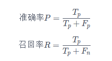

汽车行业用户观点主题及情感识别

### 赛题背景

随着政府对新能源汽车的大力扶植以及智能联网汽车兴起都预示着未来几年汽车行业的多元化发展及转变。汽车厂商需要了解自身产品是否能够满足消费者的需求，但传统的调研手段因为样本量小、效率低等缺陷已经无法满足当前快速发展的市场环境。因此，汽车厂商需要一种快速、准确的方式来了解消费者需求。

### 赛题任务

本赛题提供一部分网络中公开的用户对汽车的相关内容文本数据作为训练集，训练集数据已由人工进行分类并进行标记，参赛队伍需要对文本内容中的讨论主题和情感信息来分析评论用户对所讨论主题的偏好。讨论主题可以从文本中匹配，也可能需要根据上下文提炼。

### 数据背景

数据为用户在汽车论坛中对汽车相关内容的讨论或评价。

### 数据说明

（1）训练数据： 训练数据为CSV格式，以英文半角逗号分隔，首行为表头，字段说明如下：

| 字段名称        | 类型   | 描述     | 说明                           |
| --------------- | ------ | -------- | ------------------------------ |
| content_id      | Int    | 数据ID   | /                              |
| content         | String | 文本内容 | /                              |
| subject         | String | 主题     | 提取或依据上下文归纳出来的主题 |
| sentiment_value | Int    | 情感分析 | 分析出的情感                   |
| sentiment_word  | String | 情感词   | 情感词                         |

> 训练集数据中主题被分为10类，包括：动力、价格、内饰、配置、安全性、外观、操控、油耗、空间、舒适性。

> 情感分为3类，分别用数字0、1、-1表示中立、正向、负向。

> content_id与content一一对应，但同一条content中可能会包含多个主题，此时出现多条记录标注不同的主题及情感，因此在整个训练集中content_id存在重复值。其中content_id，content，subject，sentiment_value对应字段不能为空且顺序不可更改，否则提交失败。

> 仅小部分训练数据包含有情感词sentiment_word，大部分为空，情感词不作为评分依据。

> 字段顺序为：content_id，content，subject，sentiment_value，sentiment_word

（2）测试数据：测试数据为CSV格式，首行为表头，字段为：

| 字段名称   | 类型   | 描述     |
| ---------- | ------ | -------- |
| content_id | Int    | 数据ID   |
| content    | String | 文本内容 |

作品要求

| 字段名称        | 类型   | 描述     | 说明                              |
| --------------- | ------ | -------- | --------------------------------- |
| content_id      | Int    | 数据ID   | /                                 |
| content         | String | 文本内容 |                                   |
| subject         | String | 主题     | 提取或依据上下文归纳出来的主题    |
| sentiment_value | Int    | 情感分析 | 情感值（-1:负向  0:中性  1:正向） |
| sentiment_word  | String | 情感词   | 情感词                            |

> 参赛者提交的结果数据中，每行数据的subject必须为训练集中给出的10类之一，即：动力、价格、内饰、配置、安全性、外观、操控、油耗、空间、舒适性中的一个。

> 参赛者提交的结果数据中，每行数据的sentiment_value必须为训练集中给出的3类之一，即：0、1、-1中的一个。

> content_id必须与测试集数据相同，对于同一条content中分析出多个主题和情感，应以多条记录（多行数据）的方式进行提交，且content_id不变。

> 本赛题在判断结果正确性时按照“主题+情感值”精确匹配的方式，参赛者如无法得出“主题”或“情感值”任意一项，则此条数据也应被包含在结果数据中，除id外其他为空即可。

### 评分方式

本赛题采用F1-Score评价方式。按照“主题+情感分析”识别数量和结果（是否正确）来进行判断，参赛者需要识别文本中可能包含的多个“主题”。

（1）匹配识别结果
 Tp：判断正确的数量；
 Fp：判断错误或多判的数量；
 Fn；漏判的数量；
 关于Tp、Fp、Fn的统计规则说明如下：

> 当提交的一条数据结果包含“主题+情感值”，如果参赛者对“主题+情感”的判断结果完全正确则计入Tp，如果对“主题”或“情感值”的判断结果错误则计入Fp；

> 如果参赛者未能对某一数据文本判断“主题”或“情感值”给出判断结果，则此条数据不能包含在结果文件中；

> 如果参赛者识别出的“主题+情感值”数量少于测试样本中实际包含的数量，或未对某个测试样本数据给出结果，缺少的数量计入Fn；

> 如果参赛者识别出的“主题+情感值”数量多于测试样本中实际包含的数量，超出的数量计入Fp；

（2）计算准确率（P）与召回率（R）

（3）最终以F1参数作为评分标准

## 方案一

> 传统做法：原始文本清洗、分词、去除停用词，基于词袋模型、TFIDF、onehot构建文本特征。通过xgboost多分类，采用pipeline的方式，即先预测主题（十分类），再根据主题（三分类）预测对应的情感极性。

#### 1.使用jieba分词

  jieba.cut(sentences,cut_all = True,HMM = True)

  对于“今天星期五”这句话，cut_all=True会分成词语：“今天”, “天星”, “星期”, “星期五”；

cut_all=False会分成词语：“今天”, “星期五”。

#### 2.使用word2vec生成词向量做特征

   model = Word2Vec(sentences,min_count = 1,size = 100,seed = 0,workers = 1)

  在环境变量中新建用户变量PYTHONHASHSEED，随便设置为一个整数。

 对于“今天星期五”这句话：

#### 3.调用xgboost模型

以主题为例（subject）

 (1)设置objective为multi:softprob，num_class为10，生成每一类别的概率矩阵

  (2)将其做成一列，按概率从大到小排序

  (3)按照[contend_id,subject]去重

  (4)按照content_id去重，将去重后的结果concat到之前结果的前面

  (5)按照整行的信息去重，取前m=round(len(train)/len(set(train[‘content_id’]))*len(set(test[‘content_id’])))个结果

情感（sentiment_value）同样的做法，每条样本取概率最大的情感。

这样以主题预测的结果m个结果，以content_id连接预测情感，一条样本多个主题，一个情感。

## 方案二（TextCNN）

> 在本次方案中我尝试了FastText, TextCNN, TextRNN, TextBiRNN, TextRCNN, HAN等多种深度学习解决方案，借着本次机会，也阅读了些论文，对其基本框架有一定了解，在比赛当中TextCNN效果相对较好，我就以TextCNN为例给大家说明一下。

TextCNN 是利用卷积神经网络对文本进行分类的算法，Convolutional Neural Networks for Sentence Classification(论文)，卷积具有局部特征提取的功能,可用CNN 来提取句子中类似关键信息.

#### 1.Embedding Layer

通过一个隐藏层, 将 one-hot 编码的词投影到一个低维空间中。 对于CNN的输入和输出都是固定的，vector_size，sentence_length  超过的截断, 不足的补0

#### 2.Convolution Layer

第一纬是批次的大小，第二纬是句子的长度，第三纬是每个词向量的纬度，第四维都是1

#### 3.Max-Pooling Layer

max-pooling输出最大值, 对输入中的补0 做过滤.

#### 4.SoftMax 分类  Layer

最后接一层全连接的softmax 层，输出每个类别的概率

#### 5.pipeline方式

先确定主题（10个类别），再确定情感（3个类别）  

#### 6.特征层面：

嵌入层：引入词向量：Fasttext

https://fasttext.cc/docs/en/crawl-vectors.html

词向量：构建词字典传入网络

## 情感纠正

> 通过构建的同义词库，对模型结果进行修正

**价格为例**：

#### 1.情感词---同义替换

  负向情感词：高,贵,不低,不便宜,不会便宜, 便宜货……   ---------价格高

  正向情感词：不高,不虚高,不贵,不是很贵,低,便宜 ……   ---------价格低

#### 2.筛选

  选出训练集、测试集中包含同义词筛选出来作为新的训练集、测试集。

#### 3.再次训练

  保留原始训练结果中预测为-1和1的样本，加入再次训练得到的-1和1的样本

#### 4.结果

  测试了“价格”、“内饰”、“外观”、“操控”，收获可以

## 模型融合

最后一步就是将多个模型进行融合

方案整理的不够详细，如果有什么疑问，可以按照github上邮箱(972913434@qq.com)进行联系
